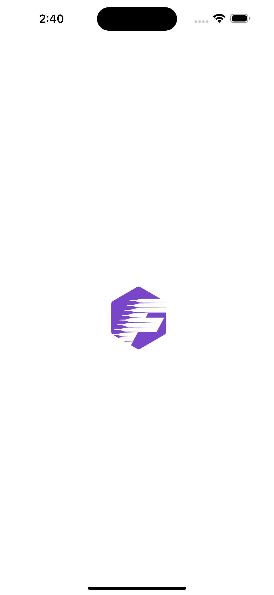
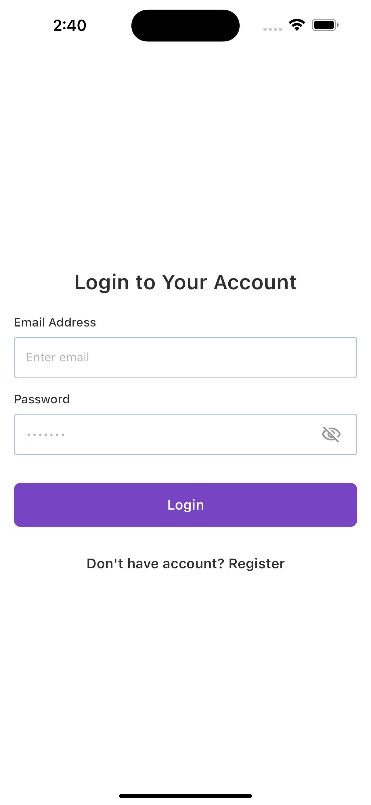
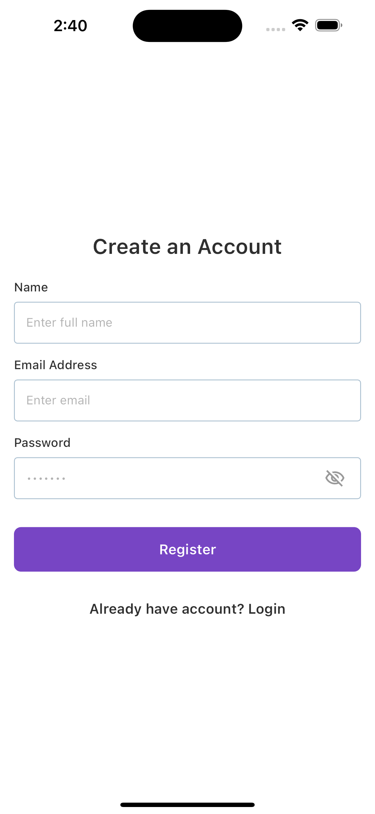
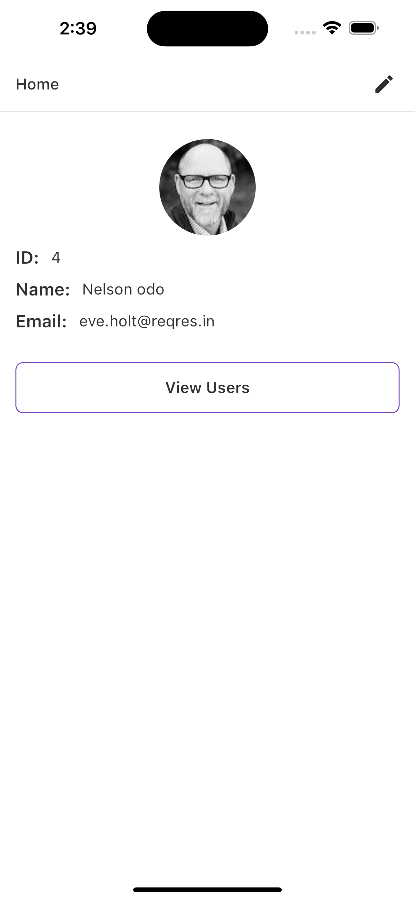
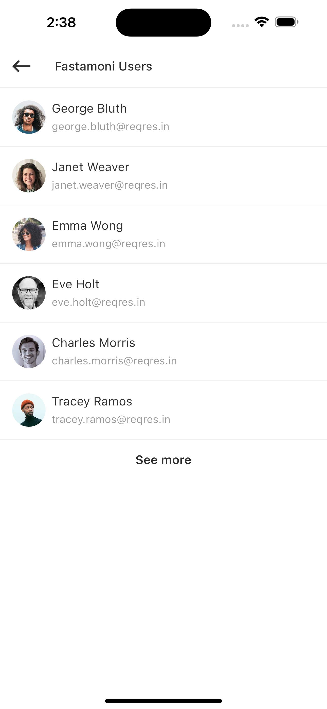

# Fastmoni Test App

Fastamoni mobile application

## Getting Started

Test flutter mobile application with 'https://reqres.in/' api and provider for state management. It consists of

- a login screen
- a screen to create a new user,
- a homepage displaying User full name
- a screen to edit user detail
- A paginated screen showing all the users

## Screens

### Splash screen

### Login screen

### Register screen

### Home screen

### Users screen

<!-- 

 -->
